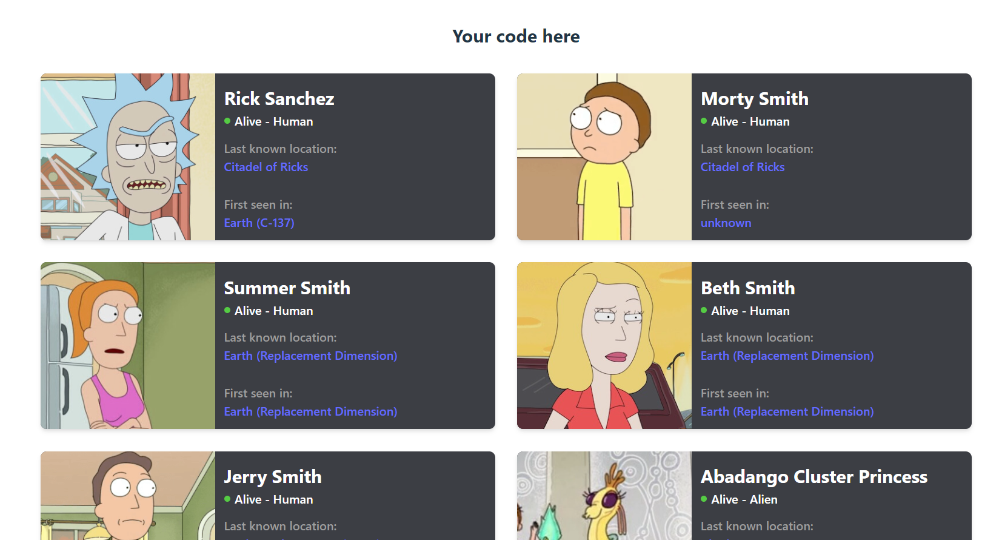

# Uso de PropTypes en los Componentes

Ejercicio de practica para usar los propTypes en los componentes que reciben props

## Table of contents

- [Overview](#overview)
  - [The challenge](#the-challenge)
  - [Screenshot](#screenshot)
- [My process](#my-process)
  - [Built with](#built-with)
  - [What I learned](#what-i-learned)
- [Author](#author)
- [Acknowledgments](#acknowledgments)

## Overview

### The challenge

Crear el componente CharacterCard y configurar propTypes

### Screenshot

## My process

### Built with

- React using vite
- CSS custom properties
- Flexbox
- Props-type library

### What I learned

I learn and practice how use the proptypes in the component.

## Author

- Website - [Welinton Suarez](https://github.com/wesgdev1)

## Acknowledgments

Thanks to MIR for teaching me how to be Fullstack Web developer
